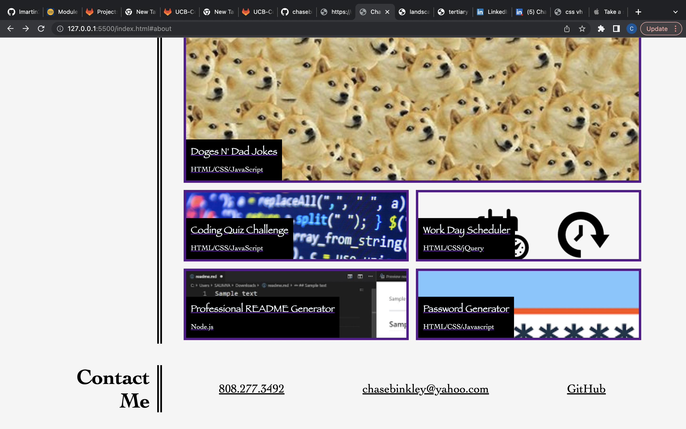

# Chase Binkley Portfolio

My professional portfolio page.

## Description

I have created a portfolio page that includes my name, a picture of myself and showcases some of the previous projects I have completed. When the links present on the navbar are clicked, they take the user to either the corresponding part on the page or to my linkedin page for my resume (coming soon). There are also links on the page that when clicked will take the user to my other projects I have created. Users can view this site on different devices or screen sizes and it will adapt to fit the screen.

## Screenshots

### Link
https://chasebinkley.github.io/Chase-Binkley-Portfolio/

